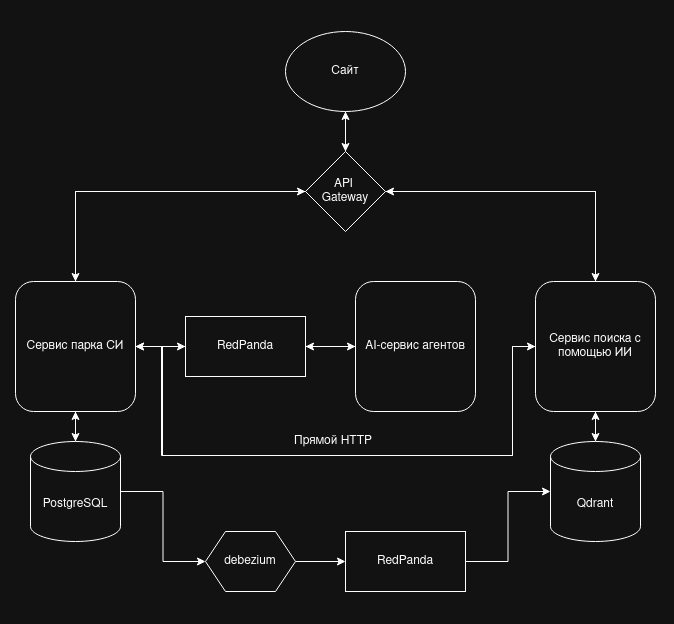

# Архитектура проекта

---

## Описание работы

### Принцип работы AI-powered поиска:
В данном проекте выбор архитектурного решения пал на гибрида с прогрессивной загрузкой

Общий механиз выглядит так:
1. Пользователь набирает в поисковой строке то, что планирует найти
2. система отправляет запрос в API Gateway
3. API Gateway отправляет два параллельных запроса на поиск, один в сервис парка СИ для поиска по полнотекстовому индексу, второй для поиска значений в векторной базе
4. В сервисе поиска с помощью ИИ, модель получает введённое пользователем значение, корнвертирует его в эмбеддинги и отправляет в сервис для получение данных из векторной базы
5. Векторная база возвращает ID записей, которые мы используем при прямом HTTP-запросе к сервису парка СИ для получения данных
6. Получаем нужные результаты 
7. Возвращаем результат на клиент

Обоснование выбора архитектурного подхода
Выбран гибридный поиск с прогрессивной загрузкой результатов. Данное решение обусловлено следующими факторами:
1. Ограничения полного дублирования данных в Qdrant
Хранение полных JSON-карточек в Qdrant в качестве payload было отвергнуто по ряду причин:
 - Qdrant не предназначен для частых обновлений. Векторная база оптимизирована под операции поиска ближайших соседей, а не под OLTP-нагрузку (постоянное изменение полей). При изменении цены, описания или статуса карточки в сервисе парка СИ потребуется перестраивать payload в Qdrant, что приведёт к деградации производительности
 - Раздувание индекса. Увеличение объёма payload-данных напрямую влияет на потребление оперативной памяти и скорость поиска, так как Qdrant загружает payload в память. Это противоречит требованию масштабируемости системы при росте числа карточек
 - Нарушение принципа Single Source of Truth. Дублирование данных создаёт риск рассинхронизации: парк-сервис и Qdrant могут содержать разные версии одной карточки, что недопустимо для поисковой выдачи
2. Преимущества выбранного подхода
 - Низкая связанность сервисов. Search Orchestrator взаимодействует с сервисом парка СИ только через стабильный API-контракт (GET /api/cards?ids=...), не зная внутреннего устройства базы данных и поискового индекса парк-сервиса
 - Масштабируемость. Каждый сервис масштабируется независимо под свою нагрузку: парк-сервис — под запросы карточек, AI-сервис — под вычисление эмбеддингов, Qdrant — под векторный поиск
 - Time to First Result. Благодаря прогрессивной загрузке через Server-Sent Events пользователь получает первые результаты от полнотекстового индекса за ≈50 мс, не дожидаясь завершения семантического поиска (≈400 мс). Это обеспечивает ощущение мгновенного отклика системы
 - Отказоустойчивость. При недоступности AI-сервиса или Qdrant поиск продолжает работать, возвращая результаты полнотекстового индекса (graceful degradation)

---

### Принцип работы агента классификации СИ по сроку службы:

Назначение: автоматическое выявление средств измерений (СИ), приближающихся к дате снятия с учёта, на основе анализа срока службы и данных метрологического учёта
Принцип работы:
1. Получает данные СИ из сервиса парка (дата ввода в эксплуатацию, межповерочный интервал, тип СИ)
2. Классифицирует СИ по категориям: «в норме», «приближается к снятию», «требует замены»
3. Формирует перечень СИ, требующих внимания, с указанием остаточного срока
4. Результаты передаются в систему уведомлений (email/дашборд)

Используемые методы: rule-based классификация с настраиваемыми порогами срабатывания
Входные данные: записи СИ из PostgreSQL (сервис парка)
Выходные данные: категоризированный список СИ с признаком срочности

--- 

### Принцип работы агента планирования закупок (прогнозная модель):
Назначение: прогнозирование потребности в закупке новых средств измерений на основе исторических данных о списаниях, сроках службы и плановых объёмах поверок
Принцип работы:
1. Анализирует исторические данные: количество СИ, выбывающих по сроку службы за предыдущие периоды
2. Учитывает прогнозные данные от агента классификации (ожидаемое снятие с учёта)
3. Формирует прогноз потребности в закупках на следующий период (месяц/квартал/год)
4. Ранжирует позиции по приоритетности: критические (точно выбывают) и рекомендуемые (вероятностный прогноз)

Используемые методы: прогнозирование временных рядов (экспоненциальное сглаживание / скользящее среднее) + корректировка на данные агента классификации
Входные данные: исторические данные списаний, результаты агента классификации, плановый график поверок
Выходные данные: план закупок с указанием количества, типа СИ и приоритета

---