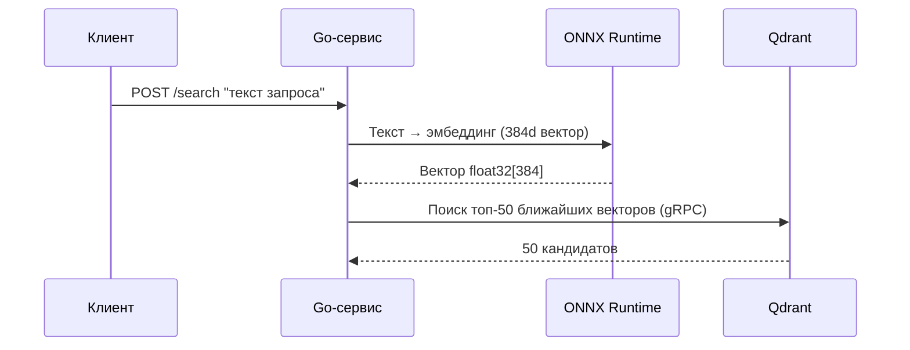
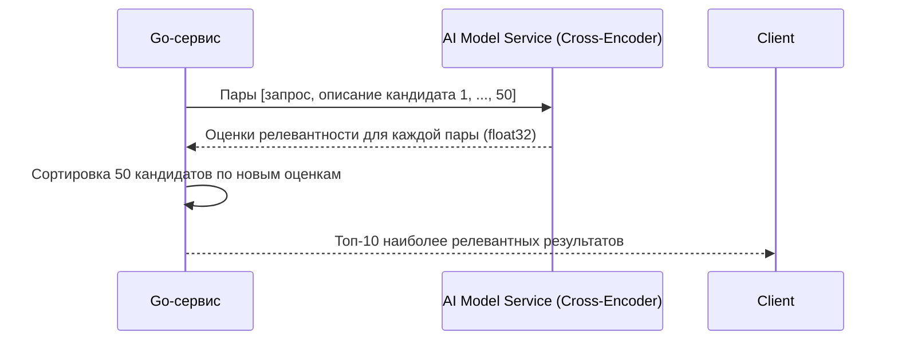

# Работа с сервисом AI-powered поиска (раздел меняется в ходе разработки, т.к. не весь сервис готов)

## Перед началом работы
В сервисе используется работа с векторной базой данных [Qdrant](https://qdrant.tech/documentation/overview/), для понимания принципов функционирования и возможностей данной системы рекомендуется ознакомиться с её общей концепцией и документацией

---

## Как работает сервис
Сервис представляет собой AI-powered поисковую систему, основанную на двухэтапном векторном поиске. 
Процесс работы можно разделить на четыре этапа: 
- подготовка моделей
- запуск инфраструктуры
- обработка запросов (первый этап — быстрый поиск)
- переранжирование результатов (второй этап — точная фильтрация)

Такое разделение позволяет сбалансировать скорость и точность: 
- **Этап 1** быстро находит потенциально релевантные документы (полнота / recall)
- **Этап 2** тщательно перепроверяет и пересортировывает найденное (точность / precision)

Общая последовательность действий выглядит следующим образом:

`Пользовательский запрос → Эмбеддинг (ONNX) → Qdrant (поиск топ-50) → Кросс-энкодер (переранжирование) → Топ-10 результатов`

### Этап 1: Подготовка моделей (при сборке Docker)
При запуске сервиса через Docker происходит автоматическая подготовка двух типов моделей:

#### 1. Модель для быстрого поиска (Bi-Encoder / Embedding)
1. Загрузка модели из Hugging Face:
    - Docker запускает Python-скрипт downloader.py
    - Скрипт считывает имя модели из переменной `model_from_hugging_face` в файле `config/config.env`
    - Модель скачивается в директорию `src/search_engine/ai_model/model/`
2. Конвертация в ONNX формат:
    - После успешной загрузки модель автоматически конвертируется в формат .onnx
    - ONNX позволяет оптимизировать инференс (до 2-3x ускорение) и уменьшить потребление памяти
    - Сконвертированная модель сохраняется в `src/search_engine/ai_model/onnx_model/`
    - Go-сервис будет использовать именно ONNX версию для генерации эмбеддингов

>Почему ONNX? 
>Формат ONNX обеспечивает аппаратно-независимую оптимизацию, позволяет использовать GPU ускорение и значительно снижает latency при генерации эмбеддингов по сравнению с чистой PyTorch моделью.

#### 2. Модель для точного переранжирования (Cross-Encoder / Reranker)
Для повышения точности поиска используется второй тип модели — кросс-энкодер.
- В отличие от embedding-модели, которая смотрит на запрос и документ **по отдельности**, кросс-энкодер анализирует пару "запрос + документ" **совместно**. Это даёт значительно более высокую точность различения близких по смыслу понятий (например, "амперметр" vs "мультиметр").
- Из-за более высокой вычислительной сложности кросс-энкодер применяется не ко всей базе, а только к небольшому списку кандидатов (например, топ-50), найденных на первом этапе.
- Модель загружается из Hugging Face (переменная `reranked_model` в `config.env`) и запускается как отдельный микросервис `AI Model Service`, поскольку её архитектура оптимизирована для работы через PyTorch, а не ONNX.
- Для русского языка рекомендуется использовать модели семейства `cointegrated/rubert-base-cased-nli-threeway` или `DiTy/cross-encoder-russian-msmarco`.

### Этап 2: Запуск инфраструктуры (Docker Compose)
| Компонент | Назначение | 
|-----------|------------|
| **Qdrant** | Векторная база данных для хранения и поиска эмбеддингов |
| **Go-сервис** | Основное приложение для оркестрации двухэтапного поиска |
| **AI Model Service** | Микросервис для инференса модели переранжирования (Cross-Encoder) |


#### Порядок запуска:
1. Сначала стартует Qdrant (ожидание готовности проверяется через health-check)
2. Затем запускается `AI Model Service` с кросс-энкодером
3. Go-сервис проверяет наличие ONNX модели и доступность обоих сервисов
4. Go-сервис инициализирует коллекцию в Qdrant (создаёт, если отсутствует)

### Этап 3: Обработка поискового запроса (Этап 1 — Быстрый поиск)
На этом этапе embedding-модель быстро находит потенциально релевантные документы по всей базе. Главная цель — полнота охвата (recall), чтобы не пропустить ничего важного.



### Этап 4: Переранжирование результатов (Этап 2 — Точная фильтрация)
На этом этапе кросс-энкодер тщательно перепроверяет каждый из 50 найденных кандидатов и выставляет им новые оценки релевантности. Главная цель — точность (precision), чтобы наверху оказались только действительно релевантные результаты.



#### Почему два этапа?
Двухэтапная архитектура решает классическую проблему семантического поиска — различение близких, но не идентичных понятий.

**Пример:** Пользователь ищет "амперметр". Embedding-модель может поставить мультиметр выше амперметра, потому что оба прибора семантически связаны с измерением электрических параметров. Кросс-энкодер, анализируя пару `("амперметр", описание мультиметра)`, видит, что мультиметр — универсальный прибор, а пользователь ищет специализированный, и "отодвигает" его вниз, поднимая настоящие амперметры.

---

## Настройка и конфигурация:

Для правильной работы сервиса, его нужно правильно настроить, для этого нужно
 1. Перейти по пути `src/search_engine/config`
 2. Переименовать файл `config.env.example` в `config.env`
 3. Указать правильные параметры

### Параметры

Файл конфигурации состоит из следующих полей:
 - `qdrant_host` - хост машины, на которой нужно развернуть Qdrant
 - `qdrant_port_grpc` - _**grpc**_ порт, по которому будем обращаться к Qdrant
 - `collection_name` - имя **создаваемой** коллекции (подробнее узнать про коллекции можно [здесь](https://qdrant.tech/documentation/manage-data/collections/))
 - `model_from_hugging_face` - идентификатор модели-биэнкодера (Embedding) на [Hugging Face](https://huggingface.co/) для первого этапа поиска
 - `reranker_model` - идентификатор модели-кроссэнкодера (Reranker) на [Hugging Face](https://huggingface.co/) для второго этапа переранжирования. Рекомендуется: `DiTy/cross-encoder-russian-msmarco`
 - `reranker_top_k` - количество кандидатов, которое embedding-модель передаёт кросс-энкодеру на переранжирование (по умолчанию 50)
 - `final_top_k` - сколько результатов возвращается клиенту после переранжирования (по умолчанию 50)
 - `qrdant_distance_type` - тип Метрики расстояния для измерения сходства между векторами (подробнее [здесь](https://qdrant.tech/documentation/search/search/#metrics))
 - `qdrant_vector_size` - размерность вектора. Выбирается в соответствии с выбранной вами моделью (подробнее о размерности векторов можно узнать [здесь](https://qdrant.tech/documentation/manage-data/vectors/))

--- 

## Особенности

При инициализации коллекции Qdrant также происходит настройка [HNSW](https://qdrant.tech/documentation/manage-data/indexing/#vector-index) и настройка [вакуумного оптимизатора](https://qdrant.tech/documentation/ops-optimization/optimizer/#vacuum-optimizer) с базовыми параметрами, на данный момент изменение которых через вызов функции не реализовано, однако, это есть в планах на развитие проекта
Однако, если вы чётко осознаёте и понимаете как работать с параметрами, то внести изменения можно в файле `qdrant_init.go`, расположенном по пути `src/search_engine/internal/setup/qdrant_init.go`

### Настройка:
---
>⚠️ Важно: Изменение параметров HNSW и вакуумного оптимизатора влияет на производительность, потребление памяти и скорость индексации. Неправильная настройка может привести к замедлению поиска или излишнему расходу ресурсов. Рекомендуется изменять их только при наличии понимания работы векторных индексов.
---

В файле `qdrant_init.go` есть функция `MustInitQdrantCollection`, она содержит блок кода с определением переменных:
``` go
    // параметры Hnsw
	m := uint64(16)
	ef_construction := uint64(100)
	full_scan_threshold := uint64(10000)
	on_disk := true
	payload_m := uint64(100)

	// параметры вакуумного оптимизатора
	delete_threshold := float64(0.2)
	vacuum_min_vector_number := uint64(500)
```
**Параметры HNSW**:
 - `m`: Количество ребер (связей) для каждой вершины в графе индекса. Большее значение — точнее поиск, но больше памяти требуется для хранения графа
 - `ef_construct`: Количество соседей, учитываемых при построении индекса. Большее значение — выше точность индекса, но дольше время его построения
 - `full_scan_threshold`: Минимальный размер сегмента (в килобайтах), при котором Qdrant будет использовать дополнительные индексы для payload. Если сегмент меньше этого порога, планировщик запросов предпочтет полный скан, что может быть быстрее. Примечание: 1 Кб ~ 1 вектор размерности 256
 - `on_disk`: Хранить ли HNSW индекс на диске. Если false, индекс будет храниться в оперативной памяти, что ускоряет поиск, но повышает расход RAM
 - `payload_m`: Количество дополнительных ребер в графе для вершин, учитывающих связи по payload (фильтруемым полям). Если не установлено, используется значение m

**Параметры вакуумного оптимизатора**:
 - `deleted_threshold`: Минимальная доля удаленных векторов в сегменте, при достижении которой запускается процесс оптимизации (очистки)
 - `vacuum_min_vector_number`: Минимальное количество векторов в сегменте, необходимое для запуска оптимизации. Защищает от запуска очистки на слишком маленьких сегментах

---

## Архитектурное решение: почему два этапа, а не одна модель?

В ходе проектирования системы рассматривались альтернативные подходы, которые были осознанно отклонены:

| Подход | Причина отказа |
|--------|----------------|
| **Одна embedding-модель** | Не различает близкие понятия (амперметр vs мультиметр), требуется ручной бустинг или гибридный поиск |
| **Гибридный поиск (Dense + Sparse)** | Требует хранения sparse-векторов в Qdrant, усложняет инфраструктуру |
| **Дообучение embedding-модели** | Требует большого датасета троек и времени на fine-tuning, что выходит за рамки текущей версии |
| **Двухэтапный поиск (Retrieve & Rerank)** | ✅ Выбран как оптимальный баланс точности, скорости внедрения и простоты поддержки |