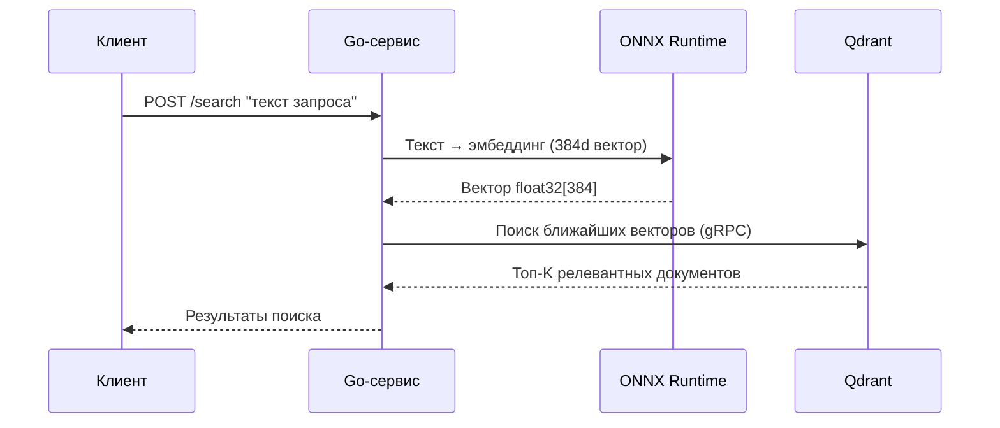

# Работа с сервисом AI-powered поиска (раздел меняется в ходе разработки, т.к. не весь сервис готов)

## Перед началом работы
В cервисе используется работа с векторной базой данных [Qdrant](https://qdrant.tech/documentation/overview/), для понимания принципов функционирования и возможностей данной системы рекомендуется ознакомиться с её общей концепцией и документацией

---

## Как работает сервис
Сервис представляет собой AI-powered поисковую систему, основанную на векторном поиске. Процесс работы можно разделить на три этапа: 
- подготовка модели
- запуск инфраструктуры
- обработка запросов

Общая последовательность действий выглядит следующим образом: 
```
Пользовательский запрос → Эмбеддинг (ONNX) → Qdrant (поиск) → Результаты
```
### Этап 1: Подготовка модели (при сборке Docker)
При запуске сервиса через Docker происходит автоматическая подготовка модели для генерации эмбеддингов:
1. Загрузка модели из Hugging Face:
    - Docker запускает Python-скрипт downloader.py
    - Скрипт считывает имя модели из переменной MODEL_FROM_HUGGING_FACE в файле config/config.env
    - Модель скачивается в директорию src/search_engine/ai_model/model/
2. Конвертация в ONNX формат:
    - После успешной загрузки модель автоматически конвертируется в формат .onnx
    - ONNX позволяет оптимизировать инференс (до 2-3x ускорение) и уменьшить потребление памяти
    - Сконвертированная модель сохраняется в src/search_engine/ai_model/onnx_model/
    - Go-сервис будет использовать именно ONNX версию для генерации эмбеддингов

>Почему ONNX? 
>Формат ONNX обеспечивает аппаратно-независимую оптимизацию, позволяет использовать GPU ускорение и значительно снижает latency при генерации эмбеддингов по сравнению с чистой PyTorch моделью.


### Этап 2: Запуск инфраструктуры (Docker Compose)
| Компонент | Назначение | 
|-----------|------------|
| **Qdrant** | Векторная база данных для хранения и поиска эмбеддингов |
| **Go-сервис** | Основное приложение для обработки поисковых запросов |
| **AI Model Service** (опционально) | Микросервис для генерации эмбеддингов через ONNX Runtime |


#### Порядок запуска:
1. Сначала стартует Qdrant (ожидание готовности проверяется через health-check)
2. Затем запускается Go-сервис, который проверяет наличие ONNX модели
3. Go-сервис инициализирует коллекцию в Qdrant (создаёт, если отсутствует)

### Этап 3: Обработка поискового запроса


---

## Настройка и конфигурация:

Для правильной работы сервиса, его нужно правилдьно настроить, для этого нужно
 1. Перейти по пути `src/search_engine/config`
 2. Переименовать файл `config.env.example` в `config.env`
 3. Указать правильные параметры

### Параметры

Файл конфигурации состоит из следующих полей:
 - `qdrant_host` - хост машины, на которой нужно развернуть Qdrant
 - `qdrant_port_grpc` - _**grpc**_ порт, по которому будем обращаться к Qdrant
 - `collection_name` - имя **создаваемой** коллекции (подрорбнее узнать про коллекции можно [здесь](https://qdrant.tech/documentation/manage-data/collections/))
 - `model_from_hugging_face` - идентификатор модели на [Hugging Face](https://huggingface.co/)
 - `qrdant_distance_type` - тип Метрики расстояния для измерения сходства между векторами (подрорбнее [здесь](https://qdrant.tech/course/essentials/day-1/distance-metrics/))
 - `qdrant_vector_size` - размерность вектора. Выбирается в соответствии с выбранной вами моделью (подробнее о размерности векторов можно узнать [здесь](https://qdrant.tech/documentation/manage-data/vectors/))

--- 

## Особенности

При инициализации коллекции Qdrant также происходит настройка [HNSW](https://qdrant.tech/documentation/manage-data/indexing/#vector-index) и настройка [вакуумного оптимизатора](https://qdrant.tech/documentation/ops-optimization/optimizer/#vacuum-optimizer) с базовыми параметрами, на данный момент изменение которых через вызов функции не реализовано, однако, это есть в планах на развитие проекта
Однако, если вы чётко осознёте и понимаете как работать с параметрами, то внести изменения можно в файле `qdrtant_init.go`, расположенном по пути `src/search_engine/internal/setup/qdrtant_init.go`

### Настройка:
---
>⚠️ Важно: Изменение параметров HNSW и вакуумного оптимизатора влияет на производительность, потребление памяти и скорость индексации. Неправильная настройка может привести к замедлению поиска или излишнему расходу ресурсов. Рекомендуется изменять их только при наличии понимания работы векторных индексов.
---

В файле `qdrant_init.go` есть функция `MustInitQdrantCollection`, она содержит блок кода с определением переменных:
``` go
    // параметры Hnsw
	m := uint64(16)
	ef_construction := uint64(100)
	full_scan_threshold := uint64(10000)
	on_disk := true
	payload_m := uint64(100)

	// параметры вакуумного оптимизатора
	delete_threshold := float64(0.2)
	vacuum_min_vector_number := uint64(500)
```
**Параметры HNSW**:
 - `m`: Количество ребер (связей) для каждой вершины в графе индекса. Большее значение — точнее поиск, но больше памяти требуется для хранения графа
 - `ef_construct`: Количество соседей, учитываемых при построении индекса. Большее значение — выше точность индекса, но дольше время его построения
 - `full_scan_threshold`: Минимальный размер сегмента (в килобайтах), при котором Qdrant будет использовать дополнительные индексы для payload. Если сегмент меньше этого порога, планировщик запросов предпочтет полный скан, что может быть быстрее. Примечание: 1 Кб ~ 1 вектор размерности 256
 - `on_disk`: Хранить ли HNSW индекс на диске. Если false, индекс будет храниться в оперативной памяти, что ускоряет поиск, но повышает расход RAM
 - `payload_m`: Количество дополнительных ребер в графе для вершин, учитывающих связи по payload (фильтруемым полям). Если не установлено, используется значение m

**Параметры вакуумного оптимизатора**:
 - `deleted_threshold`: Минимальная доля удаленных векторов в сегменте, при достижении которой запускается процесс оптимизации (очистки)
 - `vacuum_min_vector_number`: Минимальное количество векторов в сегменте, необходимое для запуска оптимизации. Защищает от запуска очистки на слишком маленьких сегментах