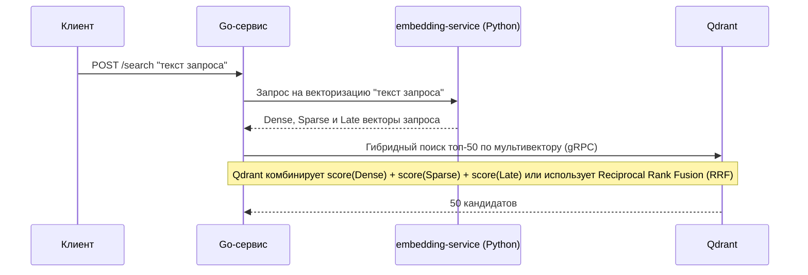
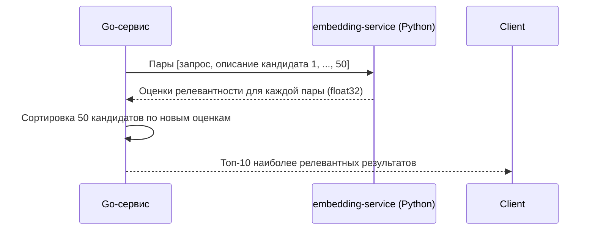

Вот переписанная документация с переименованием `AI Model Service` в `embedding-service`.

---

# Работа с сервисом AI-powered гибридного поиска

## Перед началом работы
В сервисе используется работа с векторной базой данных [Qdrant](https://qdrant.tech/documentation/overview/), для понимания принципов функционирования и возможностей данной системы рекомендуется ознакомиться с её общей концепцией и документацией, особенно в части работы с [multivector](https://qdrant.tech/documentation/manage-data/vectors/#multivectors) представлениями.

---

## Как работает сервис
Сервис представляет собой AI-powered поисковую систему, основанную на гибридном двухэтапном поиске с использованием комбинации Dense, Sparse и Late Interaction векторов, что позволяет объединить семантическое понимание запроса с точностью поиска по ключевым словам.  
Процесс работы разделен на четыре этапа:
- подготовка моделей
- запуск инфраструктуры
- обработка запросов (первый этап — быстрый гибридный поиск)
- переранжирование результатов (второй этап — точная фильтрация)

Такое разделение позволяет сбалансировать скорость и точность:
- **Этап 1** быстро находит потенциально релевантные документы, комбинируя семантическую близость (Dense) с важностью ключевых слов (Sparse) и сохраняя детальную информацию о взаимодействии токенов запроса и документа (Late Interaction). Это обеспечивает высокую полноту (recall).
- **Этап 2** тщательно перепроверяет и пересортировывает найденное, обеспечивая высокую точность (precision).

Общая последовательность действий выглядит следующим образом:

`Пользовательский запрос → embedding-service (генерация Dense/Sparse/Late векторов) → Qdrant (гибридный поиск топ-50) → embedding-service (Cross-Encoder переранжирование) → Топ-10 результатов`

### Этап 1: Подготовка моделей (при сборке Docker)
При запуске сервиса через Docker происходит автоматическая подготовка моделей, необходимых для гибридного поиска. Все модели загружаются и обслуживаются централизованным Python-сервисом (`embedding-service`).

#### 1. Модели для быстрого гибридного поиска
Для первого этапа загружаются три типа моделей, чьи векторные представления будут храниться в Qdrant как мультивектор:

1.  **Dense Embedding Model (Bi-Encoder)**
    -   **Назначение:** Генерация плотных векторов (dense vectors) фиксированной размерности. Отвечает за семантическое понимание общего смысла текста.
    -   **Загрузка:** Docker запускает Python-скрипт, который считывает имя модели из переменной `dense_model` в файле `config/config.env` и скачивает её из Hugging Face.
    -   **Формат:** Модель конвертируется в ONNX формат для оптимизации инференса (ускорение до 2-3x) и снижения потребления памяти.

2.  **Sparse Embedding Model**
    -   **Назначение:** Генерация разреженных векторов (sparse vectors). Отвечает за точное соответствие ключевым словам и терминам, компенсируя "размытость" Dense векторов. Обеспечивает поиск по редким или специфическим терминам (например, артикулам, кодам, именам собственным).
    -   **Загрузка:** Аналогично, модель скачивается из Hugging Face (переменная `sparse_model` в `config.env`) и работает в среде PyTorch.

3.  **Late Interaction Model (например, ColBERT)**
    -   **Назначение:** Генерация многомерного представления (multi-vector), где один вектор соответствует одному токену. В отличие от Bi-Encoder, который сжимает весь текст в один вектор, Late Interaction сохраняет информацию о каждом токене, что позволяет вычислить более точное взаимодействие запроса и документа на этапе поиска (MaxSim). Это дает значительный прирост точности без переранжирования, но требует хранения списка векторов для каждого документа.
    -   **Загрузка:** Модель скачивается из Hugging Face (переменная `late_interaction_model` в `config.env`) и работает в среде PyTorch.

> **Почему три модели, а не одна?**
> Каждая модель решает свою задачу. Dense-модель хороша в понимании перифраза и общего смысла, но может путать близкие понятия и пропускать редкие ключевые слова. Sparse-модель отлично ловит точные термины, но не понимает синонимы. Late Interaction модель (например, ColBERT) дает максимально детальное сравнение на уровне токенов, но ее векторы слишком объемны для хранения. Их комбинация в Qdrant позволяет использовать сильные стороны каждой, обеспечивая непревзойденное качество первого этапа.

#### 2. Модель для точного переранжирования (Cross-Encoder / Reranker)
Для финального этапа используется кросс-энкодер, который анализирует пару "запрос + документ" **совместно**. Это даёт значительно более высокую точность, чем модели первого этапа.

-   Из-за высокой вычислительной сложности кросс-энкодер применяется только к небольшому списку кандидатов (топ-50), найденных на первом этапе.
-   Модель загружается из Hugging Face (переменная `reranker_model` в `config.env`) и запускается внутри того же Python-сервиса `embedding-service`.

### Этап 2: Запуск инфраструктуры (Docker Compose)
| Компонент | Назначение |
|-----------|------------|
| **Qdrant** | Векторная база данных для хранения и гибридного поиска по Dense, Sparse и Late Interaction векторам. |
| **Go-сервис (Main App)** | Основное приложение для оркестрации поиска. Принимает запросы от клиента, общается с embedding-service за векторами и управляет поиском в Qdrant. |
| **embedding-service (Python)** | Микросервис на Python, который инкапсулирует все ML-модели. Предоставляет API для генерации Dense/Sparse/Late векторов и для кросс-энкодерного переранжирования. |

#### Порядок запуска:
1.  Сначала стартует Qdrant (ожидание готовности проверяется через health-check).
2.  Затем запускается `embedding-service`. Он загружает все необходимые модели и сообщает о своей готовности.
3.  Go-сервис проверяет доступность `embedding-service` и Qdrant.
4.  Go-сервис инициализирует коллекцию в Qdrant с поддержкой мультивекторов (создаёт, если отсутствует).

### Этап 3: Обработка поискового запроса (Этап 1 — Быстрый гибридный поиск)
На этом этапе Go-сервис получает от embedding-service все три типа векторов для запроса и выполняет гибридный поиск по всей базе. Главная цель — максимальная полнота охвата (recall).



### Этап 4: Переранжирование результатов (Этап 2 — Точная фильтрация)
На этом этапе кросс-энкодер тщательно перепроверяет каждый из 50 найденных кандидатов и выставляет им новые, более точные оценки релевантности. Главная цель — точность (precision).



#### Почему гибридный подход?
Гибридный подход с тремя моделями на первом этапе решает проблему пропуска релевантных результатов, которая есть у каждой модели по отдельности.

**Пример:** Пользователь ищет "крестовая отвертка PH2". Sparse-модель найдет документы с точным упоминанием "PH2", но может пропустить те, где написано "отвертка Phillips #2". Dense-модель поймет, что "Phillips" и "крестовая" — синонимы, но может ошибочно поднять документы про шлицевые отвертки, если те часто упоминаются в похожем контексте. Late Interaction модель сможет детально сопоставить контекст употребления каждого слова. Совместное использование и комбинация их скоринга (через взвешенную сумму или RRF) гарантирует, что ничего важное не будет упущено.

---

## Архитектурное решение: разделение на Go и Python сервисы

| Компонент | Зона ответственности |
|-----------|----------------------|
| **Go-сервис** | Высоконагруженная API-прослойка, оркестрация, общение с Qdrant, бизнес-логика. |
| **embedding-service (Python)** | Вся работа с ML-моделями: инференс Dense/Sparse/Late моделей и кросс-энкодера. |

### Почему два сервиса, а не один?
| Подход | Причина выбора/отказа |
|--------|-----------------------|
| **Всё в Python (FastAPI)** | ✅ Простота интеграции ML-моделей. ❌ Низкая производительность под высокой нагрузкой, GIL, высокое потребление памяти. |
| **Всё в Go** | ✅ Высокая производительность и низкое потребление ресурсов. ❌ Слабая экосистема для ML, сложность с ONNX-рантаймом для всех моделей, проблемы с зависимостями. |
| **Два сервиса (Go + Python)** | ✅ **Выбран как оптимальный.** Позволяет использовать сильные стороны каждого языка: Go для высоконагруженного API, Python для богатой экосистемы ML-фреймворков. Четкое разделение ответственности, независимое масштабирование. |

---

## Архитектурное решение: почему гибридный поиск?

В ходе проектирования системы рассматривались альтернативные подходы, которые были осознанно отклонены:

| Подход | Причина отказа/выбора |
|--------|-----------------------|
| **Одна Dense embedding-модель** | Не различает близкие понятия (амперметр vs мультиметр), полностью игнорирует точные совпадения ключевых слов (артикулы, коды). |
| **Гибридный поиск (Dense + Sparse)** | Значительное улучшение по сравнению с одним Dense, но всё ещё не учитывает детальные взаимодействия на уровне токенов, что может приводить к "поверхностным" результатам. |
| **Двухэтапный Dense поиск + Reranker** | Лучше, чем просто Dense, но этап переранжирования зависим от качества кандидатов с первого этапа. Если первый этап пропустил важный документ из-за неправильного сопоставления ключевых слов, Reranker его уже не увидит. |
| **Гибридный поиск (Dense + Sparse + Late Interaction)** | ✅ **Выбран как оптимальный.** Использует все три сигнала на первом этапе для максимально полного и точного отбора кандидатов. Late Interaction векторы обеспечивают высокий уровень релевантности ещё до этапа переранжирования. Может использоваться как с финальным кросс-энкодером для максимальной точности, так и без него для сценариев, критичных к задержкам. |

## Настройка и конфигурация:

Для правильной работы сервиса, его нужно правильно настроить, для этого нужно
1. Перейти по пути `src/search_engine/config`
2. Переименовать файл `config.env.example` в `config.env`
3. Указать правильные параметры

### Параметры

Файл конфигурации состоит из следующих полей:
- `qdrant_host` - хост машины, на которой нужно развернуть Qdrant
- `qdrant_port_grpc` - _**grpc**_ порт, по которому будем обращаться к Qdrant
- `collection_name` - имя **создаваемой** коллекции (подробнее узнать про коллекции можно [здесь](https://qdrant.tech/documentation/manage-data/collections/))
- `embedding_service_host` - хост для обращения к `embedding-service` (Python-сервис с моделями)
- `embedding_service_port` - порт для обращения к `embedding-service`
- `dense_model` - идентификатор модели-биэнкодера (Dense Embedding) на Hugging Face для генерации плотных векторов
- `sparse_model` - идентификатор модели спарс-энкодера (Sparse Embedding) на Hugging Face для генерации разреженных векторов
- `late_interaction_model` - идентификатор модели для позднего взаимодействия (Late Interaction, например ColBERT) на Hugging Face
- `reranker_model` - идентификатор модели-кроссэнкодера (Reranker) на Hugging Face для второго этапа переранжирования. Рекомендуется: `DiTy/cross-encoder-russian-msmarco`
- `hybrid_search_top_k` - количество кандидатов, которое первый этап гибридного поиска передаёт на переранжирование (по умолчанию 50)
- `final_top_k` - сколько результатов возвращается клиенту после переранжирования (по умолчанию 10)
- `qdrant_distance_type` - тип метрики расстояния для Dense векторов (подробнее [здесь](https://qdrant.tech/documentation/search/search/#metrics)). Для Sparse и Late векторов используются фиксированные метрики, подходящие для их природы.
- `qdrant_dense_vector_size` - размерность плотного вектора. Выбирается в соответствии с выбранной `dense_model` (подробнее о размерности векторов можно узнать [здесь](https://qdrant.tech/documentation/manage-data/vectors/))

---

## Особенности

При инициализации коллекции Qdrant также происходит настройка [HNSW](https://qdrant.tech/documentation/manage-data/indexing/#vector-index) и настройка [вакуумного оптимизатора](https://qdrant.tech/documentation/ops-optimization/optimizer/#vacuum-optimizer) с базовыми параметрами, на данный момент изменение которых через вызов функции не реализовано, однако, это есть в планах на развитие проекта.
Однако, если вы чётко осознаёте и понимаете как работать с параметрами, то внести изменения можно в файле `qdrant_init.go`, расположенном по пути `src/search_engine/internal/setup/qdrant_init.go`

### Настройка:
---
> ⚠️ Важно: Изменение параметров HNSW и вакуумного оптимизатора влияет на производительность, потребление памяти и скорость индексации. Неправильная настройка может привести к замедлению поиска или излишнему расходу ресурсов. Рекомендуется изменять их только при наличии понимания работы векторных индексов.
---

В файле `qdrant_init.go` есть функция `MustInitQdrantCollection`, она содержит блок кода с определением переменных:
```go
    // параметры Hnsw
    m := uint64(16)
    ef_construction := uint64(100)
    full_scan_threshold := uint64(10000)
    on_disk := true
    payload_m := uint64(100)

    // параметры вакуумного оптимизатора
    delete_threshold := float64(0.2)
    vacuum_min_vector_number := uint64(500)
```
**Параметры HNSW**:
- `m`: Количество ребер (связей) для каждой вершины в графе индекса. Большее значение — точнее поиск, но больше памяти требуется для хранения графа.
- `ef_construct`: Количество соседей, учитываемых при построении индекса. Большее значение — выше точность индекса, но дольше время его построения.
- `full_scan_threshold`: Минимальный размер сегмента (в килобайтах), при котором Qdrant будет использовать дополнительные индексы для payload. Если сегмент меньше этого порога, планировщик запросов предпочтет полный скан, что может быть быстрее. Примечание: 1 Кб ~ 1 вектор размерности 256
- `on_disk`: Хранить ли HNSW индекс на диске. Если false, индекс будет храниться в оперативной памяти, что ускоряет поиск, но повышает расход RAM.
- `payload_m`: Количество дополнительных ребер в графе для вершин, учитывающих связи по payload (фильтруемым полям). Если не установлено, используется значение m

**Параметры вакуумного оптимизатора**:
- `deleted_threshold`: Минимальная доля удаленных векторов в сегменте, при достижении которой запускается процесс оптимизации (очистки).
- `vacuum_min_vector_number`: Минимальное количество векторов в сегменте, необходимое для запуска оптимизации. Защищает от запуска очистки на слишком маленьких сегментах.

---